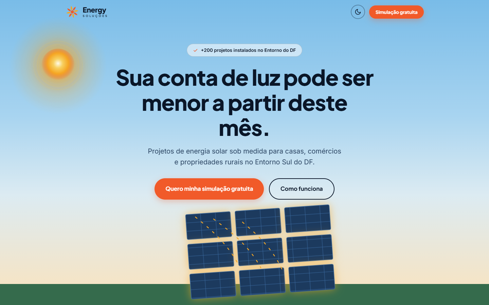
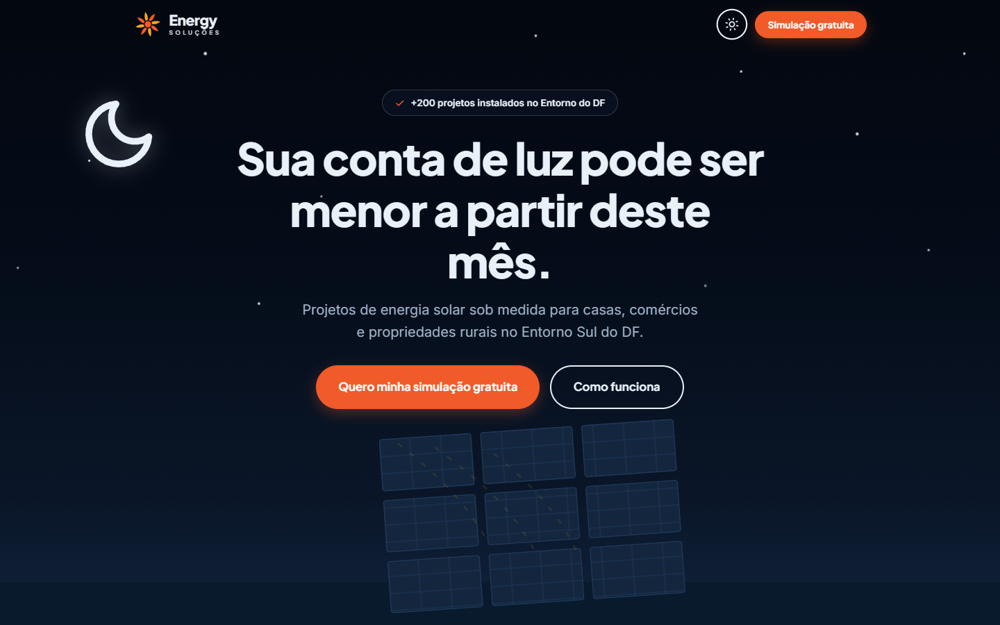
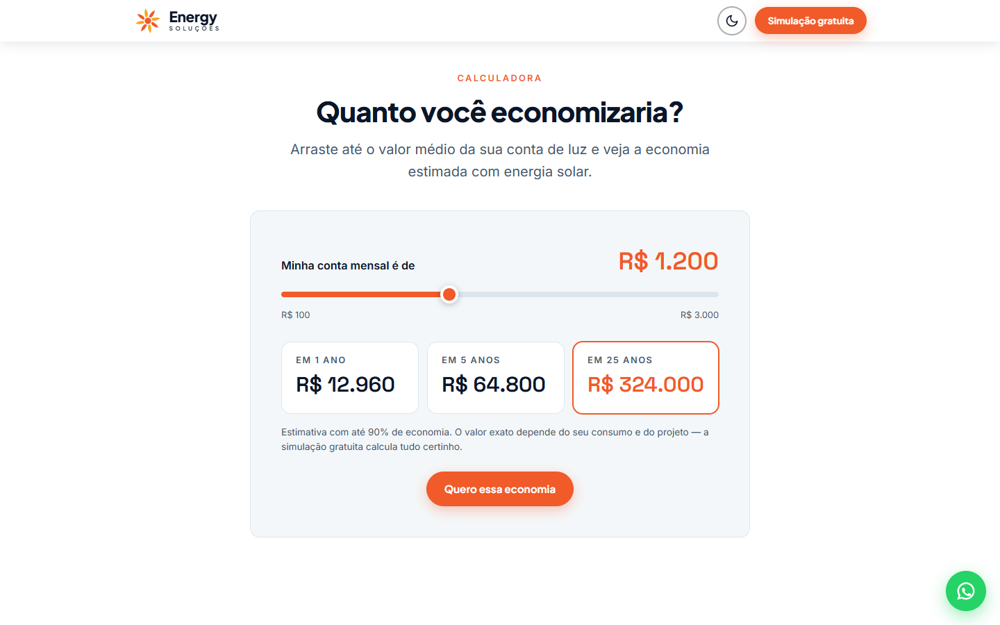
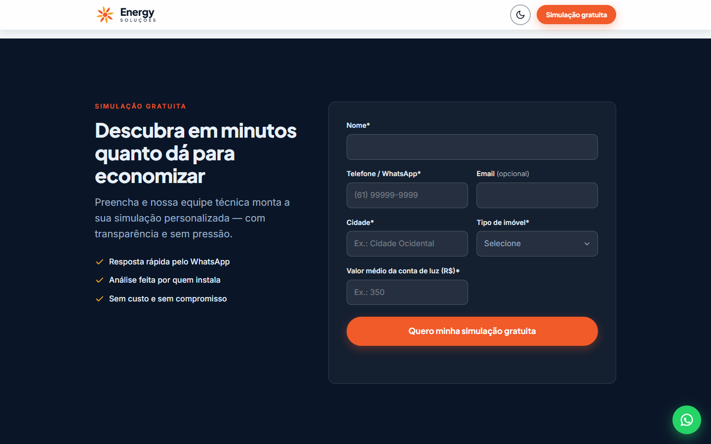

# Energy Soluções — Landing Page

Landing page freelance para a **Energy Soluções**, empresa de energia solar em Cidade Ocidental – GO, atendendo o Entorno Sul do DF.

## Preview

| Dia ☀️ | Noite 🌙 |
|:---:|:---:|
|  |  |

| Calculadora | Formulário |
|:---:|:---:|
|  |  |

## Funcionalidades

- **Toggle dia/noite como easter egg** — ao alternar, o céu muda, o sol vira lua, as estrelas piscam e os painéis param de "carregar"
- **Sol interativo** — segue o cursor via `requestAnimationFrame` com lerp suave; clique dispara burst de luz
- **Calculadora de economia** — slider da conta de luz → economia em 1 / 5 / 25 anos com count-up animado; CTA pré-preenche o formulário
- **Cards com tilt 3D** — perfis Residencial / Comercial / Rural inclinam em perspectiva seguindo o mouse
- **Parallax no hero** — camadas em velocidades diferentes no scroll, sem bibliotecas
- **Formulário dual** — modo WhatsApp (`wa.me`) ou Webhook (`fetch` POST), trocável por uma constante
- **Botão WhatsApp flutuante** — aparece após o scroll do hero
- **Scroll reveal** via `IntersectionObserver`
- **Honeypot anti-spam** no formulário
- **Persistência de tema** via `localStorage`

## Stack

- **Vite + TypeScript** — scaffold vanilla, sem React/Vue
- **CSS puro** — design system completo em custom properties, mobile-first
- **SVG inline** — zero assets externos para ícones e ilustrações
- **Fontes** — Plus Jakarta Sans · Inter · Space Grotesk (Google Fonts CDN)

## Estrutura

```
index.html              # Página completa — 12 seções, SVGs inline
public/
  favicon.svg           # Ícone sol do logo
src/
  style.css             # Tokens por tema, reset, componentes, animações
  main.ts               # Bootstrap + CONFIG central
  modules/
    theme.ts            # Toggle dia/noite + localStorage
    parallax.ts         # Camadas do hero (rAF)
    sun.ts              # Sol interativo (cursor + burst)
    tilt.ts             # Cards 3D
    calculator.ts       # Calculadora (slider + count-up + prefill do form)
    form.ts             # Validação, honeypot, envio WhatsApp/webhook
    scroll.ts           # Sticky header, reveal on scroll, botão flutuante
scripts/
  screenshot.mjs        # Playwright — gera screenshots de todas as seções
```

## Desenvolvimento

```bash
npm install
npm run dev       # http://localhost:5173
npm run build     # gera dist/
```

## Configuração antes da entrega

Ajuste as constantes no topo de [src/main.ts](src/main.ts):

```ts
const CONFIG = {
  SUBMIT_MODE: 'whatsapp',            // 'whatsapp' | 'webhook'
  WHATSAPP_NUMBER: '5561900000000',   // ← número real do cliente
  WEBHOOK_URL: 'https://...',         // ← URL n8n / RD Station
  ECONOMIA_PERCENTUAL: 0.9,           // ← % de economia (0–1)
};
```

No `index.html`, busque `<!-- PLACEHOLDER -->` para substituir:
- Número de projetos instalados
- Depoimentos de clientes
- Foto da equipe
- Métricas reais (anos no mercado, MW instalados etc.)

## Screenshots

```bash
npm install
node scripts/screenshot.mjs   # salva em screenshots/
```

Requer Chromium via `playwright-core` (instala automaticamente com `npm install`).

---

Código proprietário — uso restrito ao cliente **Energy Soluções**.
